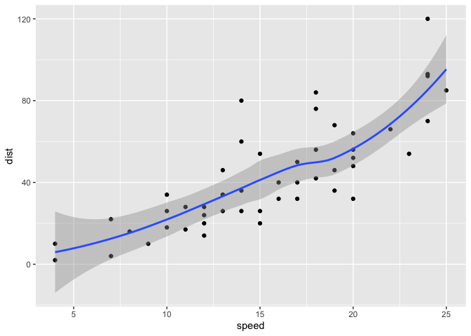

# Class 5: Data Viz with ggplot
Matt White

R has lots of ways to make figures and graphs in particular. One that
comes with R out of the box is called **“base” R** = the `plot()`
function

``` r
plot(cars)
```


A very popular package in this area is called **ggplot2**.

Before I can use any add-on package like this, I must install it with
the `install.packages("ggplot2")` command/function.

Then to use the package, I need to load it with a `library(ggplot2)`
call.

``` r
library(ggplot2)

ggplot(cars) + aes(x = speed, y = dist) + geom_point()
```


For “simple” plots like this one, base R code will be much shorter than
ggplot code.

Every ggplot has at least 3 layers - **data** (the stuff you want to
plot. always a data.frame for ggplot) - **aes**thetics (mapping of
columns from your data frame to your plot) - **geom**etries (there are
tons of these. basic ones are `geom_point()`, `geom_line()`,
`geom_col()`)

Let’s fit a model and show it on my plot:

``` r
ggplot(cars) + 
  aes(x = speed, y = dist) + 
  geom_point() +
  geom_line()
```


``` r
ggplot(cars) + 
  aes(x = speed, y = dist) + 
  geom_point() +
  geom_smooth()
```

    `geom_smooth()` using method = 'loess' and formula = 'y ~ x'



make a scatter plot (points) of mpg vs displacement

``` r
head(mtcars)
```

                       mpg cyl disp  hp drat    wt  qsec vs am gear carb
    Mazda RX4         21.0   6  160 110 3.90 2.620 16.46  0  1    4    4
    Mazda RX4 Wag     21.0   6  160 110 3.90 2.875 17.02  0  1    4    4
    Datsun 710        22.8   4  108  93 3.85 2.320 18.61  1  1    4    1
    Hornet 4 Drive    21.4   6  258 110 3.08 3.215 19.44  1  0    3    1
    Hornet Sportabout 18.7   8  360 175 3.15 3.440 17.02  0  0    3    2
    Valiant           18.1   6  225 105 2.76 3.460 20.22  1  0    3    1

``` r
ggplot(mtcars) + aes(x = mpg, y = disp) + geom_point()
```


now set size = horsepower

``` r
head(mtcars)
```

                       mpg cyl disp  hp drat    wt  qsec vs am gear carb
    Mazda RX4         21.0   6  160 110 3.90 2.620 16.46  0  1    4    4
    Mazda RX4 Wag     21.0   6  160 110 3.90 2.875 17.02  0  1    4    4
    Datsun 710        22.8   4  108  93 3.85 2.320 18.61  1  1    4    1
    Hornet 4 Drive    21.4   6  258 110 3.08 3.215 19.44  1  0    3    1
    Hornet Sportabout 18.7   8  360 175 3.15 3.440 17.02  0  0    3    2
    Valiant           18.1   6  225 105 2.76 3.460 20.22  1  0    3    1

``` r
ggplot(mtcars) + aes(x = mpg, y = disp, size = hp) + geom_point()
```


``` r
ggplot(mtcars) + aes(x = mpg, y = disp, size = hp, color = am) + geom_point()
```


Now color all points blue

``` r
head(mtcars)
```

                       mpg cyl disp  hp drat    wt  qsec vs am gear carb
    Mazda RX4         21.0   6  160 110 3.90 2.620 16.46  0  1    4    4
    Mazda RX4 Wag     21.0   6  160 110 3.90 2.875 17.02  0  1    4    4
    Datsun 710        22.8   4  108  93 3.85 2.320 18.61  1  1    4    1
    Hornet 4 Drive    21.4   6  258 110 3.08 3.215 19.44  1  0    3    1
    Hornet Sportabout 18.7   8  360 175 3.15 3.440 17.02  0  0    3    2
    Valiant           18.1   6  225 105 2.76 3.460 20.22  1  0    3    1

``` r
ggplot(mtcars) + aes(x = mpg, y = disp, size = hp) + geom_point()
```


``` r
ggplot(mtcars) + aes(x = mpg, y = disp, size = hp) + geom_point(color = "blue")
```


``` r
url <- "https://bioboot.github.io/bimm143_S20/class-material/up_down_expression.txt"
genes <- read.delim(url)
head(genes)
```

            Gene Condition1 Condition2      State
    1      A4GNT -3.6808610 -3.4401355 unchanging
    2       AAAS  4.5479580  4.3864126 unchanging
    3      AASDH  3.7190695  3.4787276 unchanging
    4       AATF  5.0784720  5.0151916 unchanging
    5       AATK  0.4711421  0.5598642 unchanging
    6 AB015752.4 -3.6808610 -3.5921390 unchanging

``` r
nrow(genes)
```

    [1] 5196

``` r
colnames(genes)
```

    [1] "Gene"       "Condition1" "Condition2" "State"     

``` r
ncol(genes)
```

    [1] 4

``` r
table(genes$State)
```


          down unchanging         up 
            72       4997        127 

``` r
127/nrow(genes)*100
```

    [1] 2.444188

``` r
table(genes$State)/nrow(genes)*100
```


          down unchanging         up 
      1.385681  96.170131   2.444188 

The `table()` function is super useful to tell me how many entries of
each type there are

``` r
p <- ggplot(genes, aes(x = Condition1, y = Condition2, col=State)) + geom_point()
p
```


``` r
#saving the plot as "p" will allow for easier addition of layers later

p + scale_colour_manual(values = c("blue", "gray", "red")) + labs(title = "Gene Expression Changes Upon Drug Treatment", x = "Control(no drug)", y = "Drug Treatment")
```


``` r
#The labs function uses titles =, x and y= for axes
```

Key Learning Points Saving plots with **ggsave()** D9fferejt plot
“types” with different `geoms_*()` Faceting with facet_wrap() Multi-plot
layout with the **patchwork** package (in section 10 of in-lab worksheet
if want to explore)

``` r
ggplot(mtcars) + aes(mpg, disp) + geom_point()
```


``` r
ggsave("myplot.pdf")
```

    Saving 7 x 5 in image

``` r
#pdf is higher resolution than png
```
